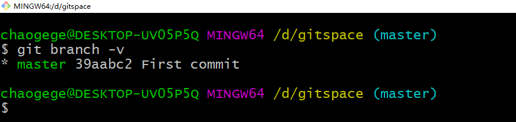
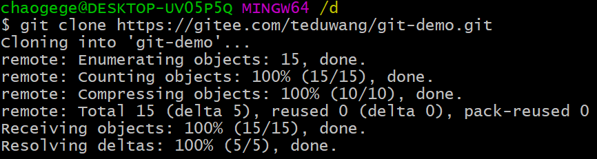
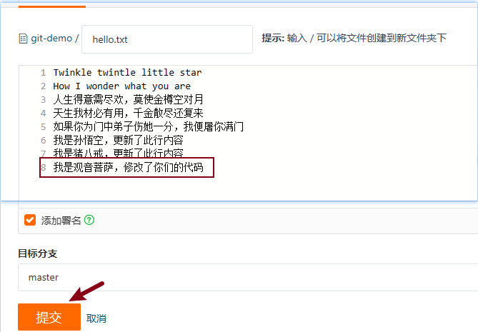
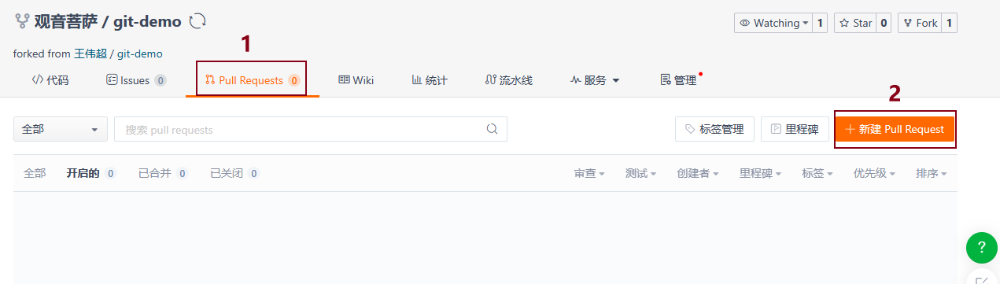
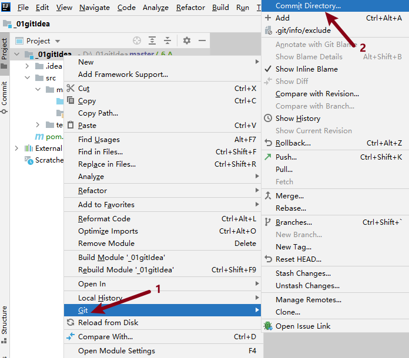

[TOC]

### 1、Git概述

​		Git是一个开源的分布式版本控制系统，可以有效、高速地处理从很小到非常大的项目版本管理。于2005年以GPL发布。采用了分布式版本库的做法，不需要服务器端软件，就可以运作版本控制，使得源代码的发布和交流极其方便。

#### 1.1 版本控制

* 何为版本控制

  ​		版本控制是一种在软件开发过程中用于管理对文件、目录或工程等内容的修改历史，方便查看更改历史记录，备份以便恢复以前的版本的软件工程技术。

  ​		版本控制最主要的功能就是追踪文件的变更，每一次文件的改变，文件的版本号都将增加。除了记录版本变更外，版本控制的另一个重要功能是并行开发。软件开发往往是多人协同作业，版本控制可以有效地解决版本的同步以及不同开发者之间的开发通信问题，提高协同开发的效率。

  

* 版本控制的作用

  从个人开发转为团队协作

  


#### 1.2 版本控制工具

##### 1.2.1 集中式版本控制工具

​		集中化的版本控制系统比如SVN ，有一个单一的集中管理的服务器，保存所有文件的修订版本，而协同工作的人们都通过客户端连到这台服务器，取出最新的文件或者提交更新。多年以来，这已成为版本控制系统的标准做法。

<font color=red>**优点**</font>

​		每个人都可以在一定程度上看到项目中的其他人正在做些什么。而管理员也可以轻松掌控每个开发者的权限，并且管理一个集中化的版本控制系统，要远比在各个客户端上维护本地数据库来得轻松容易。

<font color=red>**缺点**</font>

​		缺点是中央服务器的单点故障。如果服务器宕机一小时，那么在这一小时内，谁都无法提交更新，也就无法协同工作。

　　


##### 1.2.2 分布式版本控制工具

　　分布式版本控制工具（如Git）是一种允许开发者在本地存储和管理代码版本的系统，它不需要依赖中央服务器。这种工具可以在本地存储完整的版本历史，包括所有修改、合并等详细信息。开发者可以在本地进行提交和版本控制，并且可以随时与远程仓库进行同步。

​		相比于传统的集中式版本控制系统（如SVN），分布式版本控制系统具有更高的灵活性和安全性。由于每个开发者都可以在本地存储完整的代码库副本，因此可以更好地<font color=red>**支持远程协作和离线开发**</font>。

**优点**

​	1. 服务器断网的情况下也可以进行开发（因为版本控制是在本地进行的）

​	2. 每个客户端保存的也都是整个完整的项目（包含历史记录，更加安全)


#### 1.3 关于Git

##### 1.3.1 Git发展历史


##### 1.3.2 git工作机制

* 图解1

  

* 图解2

  

#### 1.4 代码托管中心

代码托管中心是基于网络服务器的远程代码仓库，一般我们简单称为远程仓库。

* GitHub（<font color=red>外网, 不稳定，经常无法访问</font>） https://github.com/   
* Gitee 码云（国内网站） https://gitee.com/

### 2、Git安装

​		Git客户端是一款用于管理代码版本控制的工具，它能够帮助开发者在开发过程中跟踪代码的变化，协作开发，以及管理代码库。

#### 2.1 下载地址

* 官网地址： https://git-scm.com/

* 达内文档服务器：https://doc.codeboy.com/JSD/index.html#download

  


#### 2.2 安装步骤

<font color=red>**下载安装包：Git-2.33.0.2-64-bit.exe ，直接双击安装，一路默认即可。**</font>

1. 查看 GNU 协议，可以直接点击下一步。

   

2. Git 选项配置，推荐默认设置，然后下一步。

   

3. Git 的默认编辑器，建议使用默认的 Vim 编辑器，然后点击下一步。

   

4. 默认分支名设置，选择让 Git 决定，分支名默认为 master，下一步。

   

5. 修改 Git 的环境变量，默认即可。

   

6. 选择后台客户端连接协议，选默认值 OpenSSL，然后下一步。

   

7. 是否使用OpenSSL库，默认，继续下一步

   

8. 配置 Git 文件的行末换行符，Windows 使用 CRLF，Linux 使用 LF，默认，然后继续下一步。

   

9. 选择 Git 终端类型，默认，然后继续下一步。

   

10. 选择 Git pull 合并的模式，选择默认，然后下一步。

    

11. 选择 Git 的凭据管理器，选择默认的跨平台的凭据管理器，然后下一步。

    

12. 其他配置，选择默认设置，然后下一步。

    

13. 实验室功能，技术还不成熟，有已知的 bug，不要勾选，然后点击右下角的 Install按钮，开始安装 Git。

    

14. 点击 Finsh 按钮，Git 安装成功！

    

15. 右键任意位置，在右键菜单里选择 Git Bash Here 即可打开 Git Bash 命令行终端。

    

16. 在 Git Bash 终端里输入 git --version 查看 git 版本，如图所示，说明 Git 安装成功。

    

### 3、Git常用命令

|              命令               |        作用         |
| :-----------------------------: | :-----------------: |
|  git config --global user.name  | 设置用户签名-用户名 |
| git config --global user.email  |  设置用户签名-邮箱  |
|            git init             |   初始化本地仓库    |
|           git status            |  查看本地仓库状态   |
|             git add             |    添加到暂存区     |
| git commit -m "日志信息" 文件名 |   提交到本地仓库    |
|           git reflog            |    查看历史记录     |
|     git reset --hard 版本号     |      版本穿梭       |


#### 3.1 设置用户签名

* 命令语法

  ```java
  git config --global user.name 用户名
  git config --global user.email 邮箱[可以不存在]
  ```

  

* 命令说明

  全局范围的签名设置.

  签名的作用是区分不同操作者身份。用户的签名信息在每一个版本的提交信息中能够看到，以此确认本次版本提交者的身份。<font color=red>Git 首次安装必须设置一下用户签名，否则无法提交代码</font>。

  <font color=red>**注意：这里设置用户签名和将来登录 Gitee（或其他代码托管中心）的账号没有任
  何关系。**</font>

#### 3.2 初始化本地库

* 基本语法

  ```java
  git init
  ```

* 案例实操

  * 第1步：在 计算机 - D盘 下创建目录：**gitspace**

  * 第2步：在 **gitspace** 目录下，右键打开 `Git Bash` 终端

  * 第3步：初始化本地仓库：`git init`

    

#### 3.3 查看本地库状态

* 基本语法

  ```java
  git status
  ```

* 命令演示

  

  * 首次查看，工作区无任何文件

  * 新建文件：`hello.txt` ，并在其中输入任意内容

  * 再次查看本地仓库状态：`git status`

    <font color=red>**检测未被追踪到的文件, 文件的颜色为红色**</font>

    

#### 3.4 添加暂存区

* 基本语法

  ```java
  git add 文件名
  ```

* 案例操作

  添加到暂存区后， 查看状态，检测到暂存区有新文件

  <font color=green>**添加到暂存区后，文件的颜色变为绿色**</font>

  

#### 3.5 提交到本地库

* 提交到本地库

  ```java
  git commit -m "日志信息" 文件名
  ```

* 案例操作

  <font color=red>**提交到本地仓库后，再次查看状态，没有文件需要提交**</font>

  


#### 3.6 修改文件

* 第1步：修改 `hello.txt` 文件内容；

* 第2步：查看状态，检测到工作区有文件被修改 `git status`；

* 第3步：将修改的文件再次添加到暂存区 `git add hello.txt`；

* 第4步：将修改的文件再次提交到本地仓库 `git commit -m "Second commit" hello.txt`。

#### 3.7 练习

1. D盘下创建目录 eggit1；
2. 在该目录下打开 `Git Bash` 并初始化本地仓库；
3. 创建文件 `eg1.txt` ，并任意输入内容；
4. 查看状态；
5. 将文件添加到暂存区并查看状态；
6. 提交到本地仓库；
7. 修改 `eg1.txt` 文件内容并查看状态；
8. 添加到暂存区并查看状态；
9. 提交到本地仓库。


#### 3.8 历史版本

##### 3.8.1 查看历史版本

* 基本语法

  ```java
  git reflog   // 查看版本信息
  git log      // 查看详细版本信息
  ```

* 案例操作

  

##### 3.8.2 版本穿梭

* 基本语法

  ```java
  git reset --hard 版本号
  ```

* 案例操作

  * 第1步：HEAD指针指向第二次提交的 `44fcd05` 版本；

    

  * 第2步：切换到第一次提交的 `39aabc2` 版本；

    

  * 第3步：查看 `hello.txt` 文件内容，已修改；

  * 第4步：`git reflog` 查看日志，HEAD指针已指向第一次提交的版本。

##### 3.8.3 练习

1. D盘下创建目录：`eggit2` ，并初始化仓库；
2. 创建文件 `eg2.txt` ，并查看状态；
3. 添加到暂存区并查看状态；
4. 提交到本地仓库并查看状态；
5. 修改文件内容并再次提交到暂存区和本地仓库；
6. 查看提交版本信息；
7. 穿梭到第一次提交的版本并查看文件内容确认；
8. 穿梭到第二次提交的版本并查看文件内容确认。


### 4、Git的分支操作

#### 4.1 什么是分支

​		在版本控制过程中，同时推进多个任务，为每个任务，我们就可以创建每个任务的单独分支。使用分支意味着程序员可以把自己的工作从开发主线上分离开来，开发自己分支的时候，不会影响主线分支的运行。对于初学者而言，分支可以简单理解为副本，一个分支就是一个单独的副本。


#### 4.2 分支的好处

​		同时并行推进多个功能开发，提高开发效率。

　　各个分支在开发过程中，如果某一个分支开发失败，不会对其他分支有任何影响。失败

的分支删除重新开始即可。

#### 4.3 分支操作命令

|        命令         |           作用           |
| :-----------------: | :----------------------: |
|  git branch 分支名  |         创建分支         |
|    git branch -v    |         查看分支         |
| git checkout 分支名 |         切换分支         |
|  git merge 分支名   | 将指定分支合并到当前分支 |

##### 4.3.1 查看分支

* 基本语法

  ```java
  git branch -v
  ```

* 案例操作

  <font color=red>**星号 * 代表当前所在分区**</font>

  

##### 4.3.2 创建分支

* 基本语法

  ```java
  git branch 分支名
  ```

* 案例操作

  

##### 4.3.3 修改分支

* 第1步：在master分支上做修改

* 第2步：添加至暂存区、提交到本地库

  

* 第3步：hot-fix 分支并未做任何改变、master 分支已更新为最新一次提交的版本

  

##### 4.3.4 切换分支

* 基本语法

  ```java
  git checkout 分支名
  ```

* 案例操作

  * 第1步：切换到hot-fix分支

    

  * 第2步：查看 hot-fix 分支上的文件内容发现与 master 分支上的内容不同

  * 第3步：在 hot-fix 分支上做修改

  * 第4步：添加到暂存区、提交到工作区

    

##### 4.3.5 练习

1. D盘下创建目录：`eggit3` 并初始化仓库；
2. 创建文件 `eg3.txt` 并存入任意内容；
3. 添加到暂存区，并提交到本地仓库；
4. 创建新的分支 `feature-game` ，并查看分支；
5. 切换到分支 `feature-game` ，并修改文件内容【<font color=red>只允许在下面新添加内容，不允许修改原内容</font>】；
6. 添加到暂存区，并提交到本地仓库，查看内容；
7. 切换到分支 `master` ，并查看文件内容确认；
8. 将 `feature-game` 分支合并到 `master` 分支.

##### 4.3.6 合并分支

* 基本语法

  ```java
  git merge 分支名
  ```

* 案例操作

  <font color=red>**在 master 分支上合并 feature-game 分支**</font>

  


##### 4.3.7 分支合并冲突

<font color=red>**前提：修改两个分支文件中同一行的内容**</font>

* 冲突产生的表现：后面状态为 **MERGING**

  

* 冲突产生的原因

  合并分支时，两个分支在同一个文件的同一个位置有两套完全不同的修改。Git 无法替
  我们决定使用哪一个。必须人为决定新代码内容。

* 查看冲突文件 `eg3.txt`

  

  <font color=red>**特殊符号：<<<<<<< HEAD 当前分支的代码 ======= 合并过来的代码 >>>>>>>feature-game**</font>

##### 4.3.8 解决合并冲突

* 第1步：编辑有冲突的文件，删除特殊符号，决定要使用的内容；

* 第2步：添加到暂存区；

* 第3步：执行提交（<font color=red>**注意：此时使用 git commit 命令时不能带文件名**</font>）

  `Git Bash` 中后面 MERGING 消失，变为正常

  

##### 4.3.9 练习

1. D盘目录下创建目录：`eggit4` 并初始化本地仓库；
2. 创建文件 `eg4.txt`，输入内容：`abcdefg`，并添加到暂存区提交到本地仓库；
3. 创建分支 `hot-fix` ；
4. 修改 `master` 分支文件内容，在第二行添加内容 `master-666`；
5. 添加到暂存区并提交到本地仓库；
6. 切换到 `hot-fix` 分支，修改文件内容，在第二行添加 `hot-fix-888`；
7. 添加到暂存区并提交到本地仓库；
8. 切换到 `master` 分支，将 `hot-fix` 分支合并到 `master` 分支中；
9. 解决合并冲突。

### 5、Git团队协作机制

#### 5.1 团队内协作


#### 5.2 跨团队协作


### 6、Gitee操作

**国内代码托管中心-码云**

Gitee网址：https://gitee.com/

#### 6.1 简介

码云是开源中国推出的基于 Git 的代码托管服务中心，是一个中文网站。

#### 6.2 码云帐号注册和登录

进入码云官网地址：https://gitee.com/，点击注册 Gitee，输入个人信息，进行注册即可。

#### 6.3 创建远程仓库

进入 `Gitee` 官网，登录成功后，按照如下图中所示方法创建远程仓库。

**仓库名称：git-demo， 得到仓库地址 https://gitee.com/teduwang/git-demo.git**


#### 6.4 远程仓库操作

|                命令                |                           作用                           |
| :--------------------------------: | :------------------------------------------------------: |
|           git remote -v            |                查看当前所有远程地址的别名                |
|  git remote add 别名 远程仓库地址  |                          起别名                          |
|         git push 别名 分支         |              推送本地分支上的内容到远程仓库              |
|         git clone 远程地址         |                将远程仓库的内容克隆到本地                |
| git pull 远程库地址别名 远程分支名 | 将远程仓库对于分支最新内容拉下来后与当前本地分支直接合并 |

##### 6.4.1 创建远程仓库别名

* 基本语法

  ```java
  git remote -v //查看当前所有远程地址别名
  git remote add 别名 远程地址
  ```

* 案例操作

  

##### 6.4.2 推送本地分支到远程仓库

* 基本语法

  ```java
  git push 别名 分支
  ```

* 案例操作

  **第1步：推送本地master分支到远程仓库**

  

  **第2步：到远程仓库确认**

  

##### 6.2.3 克隆远程仓库到本地

* 基本语法

  ```java
  git clone 远程地址
  ```

* 案例操作

  

* 小结

  <font color=red>**clone 会 拉取代码 并 初始化本地仓库。**</font>

##### 6.2.4 邀请加入团队

* 选择邀请合作者

  

* 复制地址并通过微信等方式发 给该用 户

  链接 ：https://gitee.com/teduwang/git-demo/invite_link?invite=452570df41e4f8d9b2d283c4a1da178a74954bb67b128ecae511b1509403e86e8735e5e53581d4605a8eecda7e932207

  

* 在 **猪八戒** 这个账号中的地址栏复制收到邀请的链接 ，点击接受邀请

  

* 在成功之后可以在 **猪八戒** 这个账号上看到 git-demo 的远程仓库。

  

* **孙悟空** 可以修改内容并 push 到远程仓库。

* 回到 **猪八戒** 的 远程仓库中可以看到，仓库内容也是更新的，反之也一样

  

##### 6.2.5 拉取远程库内容

* 基本语法

  ```java
  git pull 远程库地址别名 远程分支名
  ```

* 案例操作

  


#### 6.5 跨团队协作

* 第1步：将远程仓库地址复制发给邀请跨团队协作的人，比如：**观音菩萨**；

* 第2步：在 **观音菩萨** 的 `Gitee` 账号的地址栏中粘贴收到的链接，点击 **Fork** 将项目叉到自己的本地仓库；

  

  

* 第3步：**观音菩萨** 就可以在线编辑叉取过来的文件，并提交；

  

* 第4步：点击上方的 `Pull Request`，并创建一个新的请求；

  

  

* 第5步：回到 **孙悟空** 的账号中，可以看到有一个 `Pull request` 请求；

  


* 第6步：如果确认代码没有问题，通过后直接合并代码。


### 7、IDEA集成Git

#### 7.1 IDEA中定位Git程序

打开 IDEA ，File - Settings - Version Control - Git 进行配置


#### 7.3 初始化本地库

等价命令：`git init`

选择要创建 Git 本地仓库的工程，比如创建工程：**_01gitIdea**


**选中工程目录**


#### 7.4 添加到暂存区

右键点击项目选择 Git -> Add 将项目添加到暂存区。


#### 7.5 提交到本地库

* 选择 `Commit Directory...`



* 输入提交信息，点击 `commit`

  

#### 7.6 切换版本

在 IDEA 的左下角，点击 `Git`，然后点击 `Log` 查看版本

右键选择要切换的版本，然后在菜单里点击 `Checkout Version 版本号`。


#### 7.7 创建分支

* 第1步：右键选择 Git，点击 Branches 按钮。

* 第2步：在弹出的 Git Branches 框里，点击 New Branch 按钮。

  填写分支名称，创建 hot-fix 分支。

* 第3步：然后再 IDEA 的右下角看到 hot-fix，说明分支创建成功，并且当前已经切换成 hot-fix 分支


#### 7.8 切换分支

在 IDEA 的左下角，点击 `Git`，然后点击 `Log` 查看分支

右键选择要切换的分支，然后在菜单里点击 `Checkout`。


#### 7.9 合并分支

将 hot-fix 分支合并到当前 master 分支。

不管是否有合并冲突，分支合并成功以后，代码自动提交，无需手动提交本地库。


### 8、IDEA集成Gitee

#### 8.1 push 推送本地库到远程库

* 第1步：创建远程仓库，比如叫做：`gitIdea`

* 第2步：推送到远程仓库

  **01图**

  

  **02图**

  

  **03图**

  

  **04：远程仓库确认**

* 第3步：当修改本地代码后，提交到远程仓库

  **01图**

  

  **02图**

  


<font color=red>**注意：push 是将本地库代码推送到远程库，如果本地库代码跟远程库代码版本不一致，push 的操作是会被拒绝的。也就是说，要想 push 成功，一定要保证本地库的版本要比远程库的版本高！因此一个成熟的程序员在动手改本地代码之前，一定会先检查下远程库跟本地代码的区别！如果本地的代码版本已经落后，切记要先 pull 拉取一下远程库的代码，将本地代码更新到最新以后，然后再修改，提交，推送！**</font>

#### 8.2 pull 拉取远程库到本地库

* 第1步：修改远程仓库的代码

* 第2步：右键点击项目，可以将远程仓库的内容 pull 到本地仓库。

  

<font color=red>**注意：pull 是拉取远端仓库代码到本地，如果远程库代码和本地库代码不一致，会自动合并，如果自动合并失败，还会涉及到手动解决冲突的问题。**</font>

#### 8.3 clone 克隆远程库到本地

可以将远程仓库中的项目克隆 clone 到本地磁盘。

**01图**


**02图**


### 9、工作中正确使用git

* 第1：写代码之前先把项目从远程仓库pull下来， 先把master主分支上的代码与远程仓库同步到最新版本；
* 第2：在本地创建并切换到工作分支，创建完成后会自动切换到该分支，此时master/work分支内容是相同；
* 第3：编写代码；
* 第4：编码完成后，add commit到work分支；
* 第5：将主分支从远程仓库pull最新的版本下来；
* 第6：将工作分支合并到主分支，如果有合并冲突，则需要手动解决冲突；
* 第7：此时所有在work分支上做的修改就会合并到主分支上，最后就可以push到远程仓库上了。


### 10、学习过程中使用git

#### 10.1 前提

* 第1：注册 `Gitee` 账号；

* 第2：家中电脑安装开发环境，安装并在IDEA中配置 `Git`；

  

* 第3：创建一个远程空仓库【开源】，名字自定义。

#### 10.2 学校和家共同使用

* 第1：第1天白天正常编写代码，正常完成作业；
* 第2：晚上放学回家之前，将项目上传 `push` 到自己仓库中；
* 第3：晚上到家后，想学习，首先将远程仓库中项目中拉取 `pull` 最新代码，然后再开始写代码；
* 第4：晚上睡觉前，将写完的代码上传 `push` 到远程仓库；
* 第5：第2天到学校，第一时间拉取 `pull` 远程仓库的代码到本地，然后开始上课编写代码；
* 第6：如此循环... ...

<font color=red>**注意：**</font>

```java
1.早上到校，拉取代码；
2.晚上放学，上传代码；
3.晚上到家，拉取代码；
4.晚上睡觉，上传代码；
5.继续 1 2 3 4...
```


