[TOC]

### 1 Maven概述

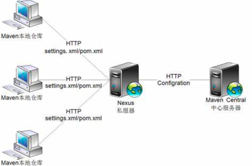

#### 1.1 为什么使用Maven

**传统项目中**

* 每次需要 `jar` 包时到官网下载；

  借助 `maven` 我们可以使用统一的规范方式下载jar包；

* 不同项目中使用 `jar` 包，需要频繁 “复制”、“粘贴” 到不同项目的lib中；

  同样的 `jar` 包重复的出现在不同的项目工程中，你需要做不停的复制粘贴的重复工作。借助 `maven`，可以将 `jar` 包保存在“仓库”中，不管在哪个项目只要使用引用即可就行；

*  `jar` 包依赖问题需要自行解决；

  使用 `a.jar` , 但是它依赖于 `b.jar` , 需要手动导入 `b.jar`，极大的增加了导包成本，借助于 `maven`，会自动的将依赖的 `jar` 包导入进来。

#### 1.2 Maven 是什么

​	Maven 是一个项目管理和整合工具。通过对 目录结构和构建生命周期 的标准化， 使开发团队用极少的时间就能够自动完成工程的基础构建配置。

​	Maven 简化了工程的构建过程，并对其标准化，提高了重用性。

### 2 Maven环境配置

<font color=red>**注意：IDEA中已经集成了Maven，也可以使用自己安装的Maven环境.**</font>

* 第1步：安装 `JDK1.8`；
* 第2步：设置 `JAVA_HOME` 环境变量，并将 Java 编译器地址添加到系统路径 `path` 中；
* 第3步：下载 Maven
  * 官网下载地址：https://maven.apache.org/download.cgi
  * 达内文档服务器：https://doc.codeboy.com/JSD/index.html
* 第4步：配置 `maven` 的相关环境变量
  - 在环境变量增加 `M2_HOME`，路径是 `maven` 解压后的根目录
  - 在环境变量里的 `path` 中增加 `maven/bin` 的目录

* 第5步：验证

  在cmd命令行中输入命令：`mvn -v` 查看 `Maven` 版本

  <font color=red>看到版本信息，说明Maven安装完成.</font>

  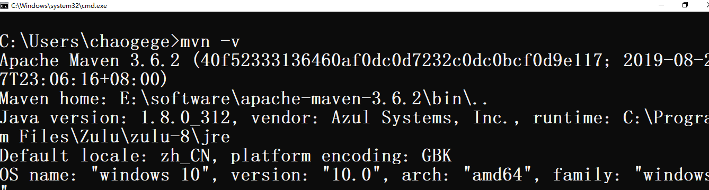

### 3 Maven目录结构

* <font color=red>**Maven工程必须按照约定的目录结构创建**</font>

  ```java
  根目录：工程名
  |---src：//源码
  |---|---main: //存放主程序
  |---|---|---java： //源码文件
  |---|---|---resources： //存放框架的资源文件
  |---|---test：//存放测试程序
  |---|---|---java: //java测试文件
  |---|---|---resources: //java测试的资源文件
  |---pom.xml：//maven的核心配置文件
  ```

* 手动创建 `Maven` 工程目录结构

  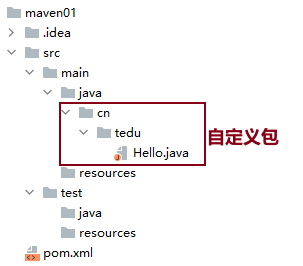

* <font color=red>**pom.xml文件说明**</font>

  <font color=red>**Maven 工程结构和内容被定义在 `pom.xml` 文件中，是 Project Object Model (POM) 的简称，此文件是整个 Maven 系统的基础组件。**</font>

  Maven 使用约定优于配置的原则，即开发者不需要再自己创建构建过程。Maven 为工程提供了合理的默认行为。当创建 Maven 工程时，Maven 会创建默认的工程结构。开发者只需要合理的放置文件，而在 pom.xml 中不再需要定义任何配置。

  ```xml
  <?xml version="1.0" encoding="UTF-8"?>
  <project xmlns="http://maven.apache.org/POM/4.0.0"
           xmlns:xsi="http://www.w3.org/2001/XMLSchema-instance"
           xsi:schemaLocation="http://maven.apache.org/POM/4.0.0 http://maven.apache.org/xsd/maven-4.0.0.xsd">
      <modelVersion>4.0.0</modelVersion>
  
      <groupId>cn.tedu</groupId>
      <artifactId>maven01</artifactId>
      <version>1.0-SNAPSHOT</version>
  
      <properties>
          <maven.compiler.source>8</maven.compiler.source>
          <maven.compiler.target>8</maven.compiler.target>
      </properties>
  
  </project>
  ```

### 4 仓库

仓库是一个位置（place），比如目录，可以存储所有的工程 jar 文件。

Maven 仓库有两种类型：

- 本地仓库（local）：程序员自己电脑上存储资源的仓库，通过连接远程仓库获取资源
- 远程仓库（remote）：非自己电脑上的仓库，为本地仓库提供资源
  * 中央仓库：Maven团队维护，存储所有资源的仓库
  * 私服：公司范围内存储资源的仓库，从中央仓库获取资源，仅对内部开放，不对外共享


#### 4.1 本地仓库

* 本地仓库说明

  Maven 本地仓库是机器上的一个文件夹，它在你第一次运行任何 `maven` 命令的时候创建。

  Maven 本地仓库保存你的工程的所有依赖。当你运行一次 Maven 构建命令，Maven 会自动下载所有依赖的 jar 文件到本地仓库中。它避免了每次构建时都引用存放在远程机器上的依赖文件。

* 本地仓库存放位置

  本地仓库默认被创建在 `C:\Users\用户名\.m2\` 目录下。要修改默认位置，在 `%M2_HOME%\conf` 目录中的  `settings.xml` 文件中定义另一个路径。

  ```xml
  <settings xmlns="http://maven.apache.org/SETTINGS/1.0.0"
     xmlns:xsi="http://www.w3.org/2001/XMLSchema-instance"
     xsi:schemaLocation="http://maven.apache.org/SETTINGS/1.0.0 
     http://maven.apache.org/xsd/settings-1.0.0.xsd">
        <localRepository>${user.home}/.m2/repository</localRepository>
  </settings>
  ```

  <font color=red>**当运行 Maven 命令，Maven 将下载依赖的文件到你指定的路径中。**</font>

#### 4.2 中央仓库

Maven 中央仓库是由 Maven 社区提供的仓库，其中包含了大量常用的库。

中央仓库的关键概念：

- 这个仓库由 Maven 社区管理。
- 不需要配置。
- 需要通过网络才能访问。

<font color=red>**Maven中央仓库地址：https://mvnrepository.com/**</font>

<font color=red>**开发人员可以在此中央仓库中搜索所有可以获取的代码库。**</font>

#### 4.3 私服

​	私服是一种在公司内部或局域网中使用的远程仓库。它通常由公司自己搭建，用于存储公司内部开发的库和插件，也可以从中央仓库或其他远程仓库获取依赖。私服可以加快公司内部项目的构建速度，同时也可以避免外部网络不稳定对项目构建的影响。

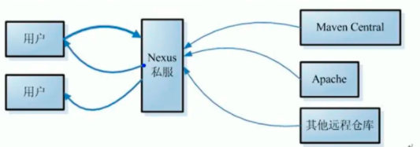

#### 4.4 阿里镜像库

* 说明

  ​		阿里镜像库是一种由阿里巴巴提供的远程仓库，它提供了和中央仓库相同的jar包和插件，但访问速度更快，因为阿里镜像库位于国内，距离更近。开发者可以从阿里镜像库中获取依赖，避免了由于网络问题导致的下载速度慢或下载失败的问题。

* 设置 `Maven` 远程仓库为阿里镜像库

  <font color=red>**在 conf/settings.xml 的 `<mirrors>` 标签下添加如下子标签 **</font>

  ```xml
  <!--添加如下配置：设置阿里镜像库-->
  <mirror>
      <id>ali</id>
      <name>ali Maven</name>
      <mirrorOf>*</mirrorOf>
      <url>https://maven.aliyun.com/repository/public/</url>
  </mirror>
  ```

  设置成功后，会从阿里的镜像库中获取依赖，不会从 `Maven` 中央仓库中获取依赖了。

### 5 坐标和依赖

#### 5.1 关于pom.xml

​	POM 即工程对象模型。它是使用 `Maven` 工作时的基本组件，是一个 xml 文件。放在工程根目录下，文件命名为 `pom.xml`。

​	POM 包含了关于工程和各种配置细节的信息，Maven 使用这些信息构建工程。

​	当执行一个任务或者目标时，Maven 会查找当前目录下的 `POM`，从其中读取所需要的配置信息，然后执行目标。

​	在创建 POM 之前，首先确定工程组（groupId），及其名称（artifactId）和版本，在仓库中这些属性是工程的唯一标识。

#### 5.2 坐标和依赖


* 什么是坐标？

  Maven中的坐标用于描述仓库中资源的位置

  <font color=red>**仓库资源地址**</font>: https://repo1.maven.org/maven2/

* 示例

  **获取MySQL驱动的 `jar`  包**

  ```xml
  <dependency>
      <!--工程组的标识,它在一个组织或者项目中通常是唯一的,公司或域名倒序+项目名-->
  	<groupId>mysql</groupId>
      <!--工程的名称,模块名-->
      <artifactId>mysql-connector-java</artifactId>
      <!--工程的版本号-->
      <version>8.0.31</version>
  </dependency>
  ```

* 坐标标签

  <font color=red>**所有的 POM 文件需要 project标签和三个必须的字段：groupId, artifactId,version。**</font>

  | 节点       | 描述                                                         |
  | :--------- | :----------------------------------------------------------- |
  | groupId    | 这是工程组的标识。它在一个组织或者项目中通常是唯一的。例如，一个银行组织 com.company.bank 拥有所有的和银行相关的项目。 |
  | artifactId | 这是工程的标识。它通常是工程的名称。例如，消费者银行。groupId 和 artifactId 一起定义了 artifact 在仓库中的位置。 |
  | version    | 这是工程的版本号。在 artifact 的仓库中，它用来区分不同的版本。例如： com.company.bank:consumer-banking:1.0 com.company.bank:consumer-banking:1.1 |

  <font color=red>**使用以上三个向量在仓库中唯一的定位一个依赖**</font>

  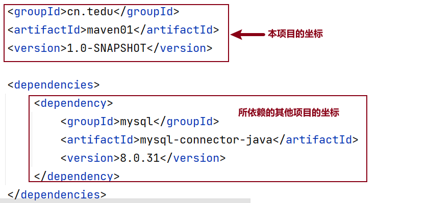

#### 5.3 依赖范围

<font color=red>**pom.xml文件中的依赖**</font>

```xml
<dependencies>
    <dependency>
        <groupId>mysql</groupId>
        <artifactId>mysql-connector-java</artifactId>
        <version>8.0.31</version>
        <!--scope标签代表指定依赖范围-->
        <scope>runtime</scope>
    </dependency>
</dependencies>
```

<font color=red>**`<scope>`标签代表指定依赖范围**</font>

* **compile，**默认值，适用于所有阶段（开发、测试、部署、运行），本jar会一直存在所有阶段；

* **runtime，**只在运行时使用，如JDBC驱动，适用运行和测试阶段；

* **test，**只在测试时使用，用于编译和运行测试代码，不会随项目发布；

* **provided，**只在开发、测试阶段使用。


### 6 Maven生命周期命令

#### 6.1 命令

|       命令       |                             作用                             |
| :--------------: | :----------------------------------------------------------: |
|   mvn compile    | 编译主程序 `src/main`，生成target目录，存放编译主程序生成的字节码文件，输出到 `target/classes` |
| mvn test-compile | 编译测试程序 `src/test`，生成target目录，存放编译测试程序生成的字节码文件，输出到`target/test-classes` |
|     mvn test     |  编写的测试代码并生成测试报告(目前对于后端开发没有太大作用)  |
|   mvn package    |                       将项目打成jar包                        |
|    mvn clean     |                     清空项目本地编译目录                     |
|   mvn install    |     将项目 安装到本地仓库(多个项目相互依赖 相互使用时.)      |

#### 6.2 运行方式

* 方式1：在终端或命令提示符中运行 `Maven` 命令；
* 方式2：在 `IDEA` 中运行 `Maven` 命令。


### 7 第一个Maven工程

* 第1步：手动创建 `Maven` 工程目录结构；

* 第2步：创建文件 `Hello.java`，内容如下：

  ```java
  package cn.tedu;
  
  public class Hello {
      public static void main(String[] args) {
          System.out.println("Hello Maven");
      }
  }
  ```

* 第3步：`pom.xml` 文件内容如下

  ```xml
  <?xml version="1.0" encoding="UTF-8"?>
  <project xmlns="http://maven.apache.org/POM/4.0.0"
           xmlns:xsi="http://www.w3.org/2001/XMLSchema-instance"
           xsi:schemaLocation="http://maven.apache.org/POM/4.0.0 http://maven.apache.org/xsd/maven-4.0.0.xsd">
      <modelVersion>4.0.0</modelVersion>
  	
      <!--工程组的标识,它在一个组织或者项目中通常是唯一的,可设置为公司域名-->
      <groupId>cn.tedu</groupId>
      <!--工程的名称,groupId 和 artifactId 一起定义了 artifact 在仓库中的位置-->
      <artifactId>maven01</artifactId>
      <!--工程的版本号,在 artifact 的仓库中，它用来区分不同的版本-->
      <version>1.0-SNAPSHOT</version>
  
      <dependencies>
          <dependency>
          <!--工程组的标识,它在一个组织或者项目中通常是唯一的,公司或域名倒序+项目名-->
          <groupId>mysql</groupId>
          <!--工程的名称,模块名-->
          <artifactId>mysql-connector-java</artifactId>
          <!--工程的版本号-->
          <version>8.0.31</version>
  	</dependency>
      </dependencies>
  
      <properties>
          <maven.compiler.source>8</maven.compiler.source>
          <maven.compiler.target>8</maven.compiler.target>
      </properties>
  </project>
  ```
  
* 第4步：执行 `Maven` 

  <font color=red>**执行maven命令必须进入到项目根目录，即：pom.xml的目录中进行执行**</font>

  * 第1条命令：<font color=red>**`mvn compile`**</font>

    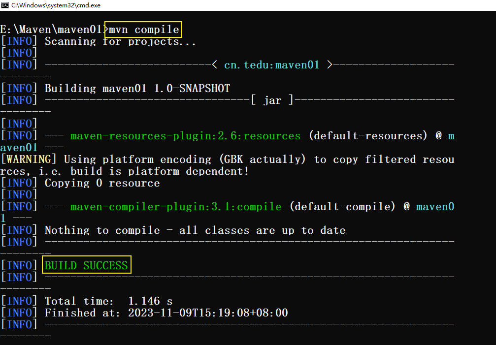

    <font color=red>**运行完毕，你在pom.xml配置的依赖的包已经导入到仓库了**</font>

    根目录下多了一个 `target` 文件夹，`target` 目录结构如下【主要存放的就是编译后的字节码文件】：

    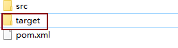

    

    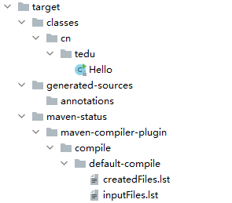

  * 第2条命令：<font color=red>**`mvn test-compile` **</font>

    编译测试程序 `src/test`，生成target目录，存放编译测试程序生成的字节码文件，输出到`target/test-classes`

    `target` 文件夹下面除了classes之外多了 `test-classes` 文件夹

  * 第3条命令：<font color=red>**`mvn package`**</font>

    将项目中的 `class` 文件和资源文件都打包成一个压缩文件。执行mvn package命令时，会同时将之前的命令（如 `mvn compile、mvn test-compile、mvn test`）都执行了。如果在执行 `mvn test` 测试时未通过，则打包过程不会成功。

  * 第4条命令：<font color=red>**`mvn clean`**</font>

    清理项目，删除 `target` 目录及其内容。执行 `mvn clean` 命令会清理之前编译、测试等操作的中间文件，以便于重新构建项目。
    
    <font color=red>target文件夹被删除了，又回到了编译之前我们手动创建的文件夹</font>


### 8 IDEA中配置并使用Maven

#### 8.1 配置Maven环境

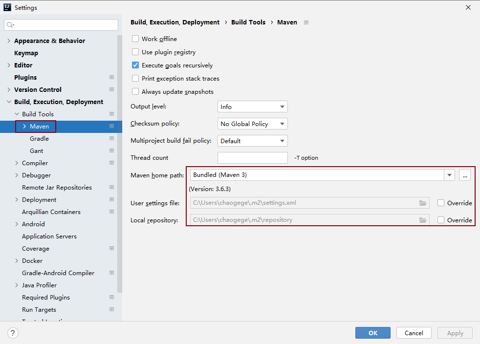

#### 8.2 创建Maven工程并执行命令

* 第1步：新建 `Module`

  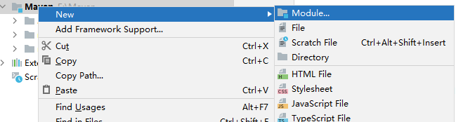

* 第2步：选择 `Maven` 

  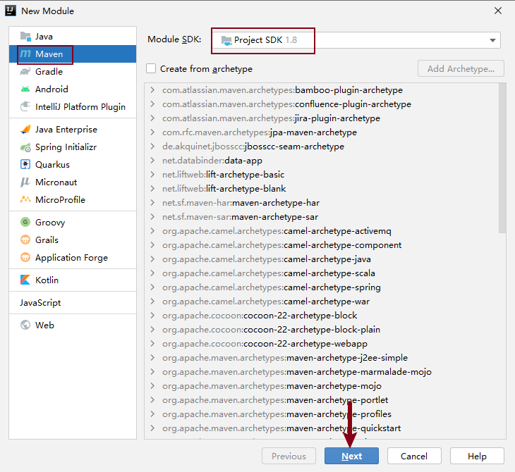

* 第3步：指定项目名称

  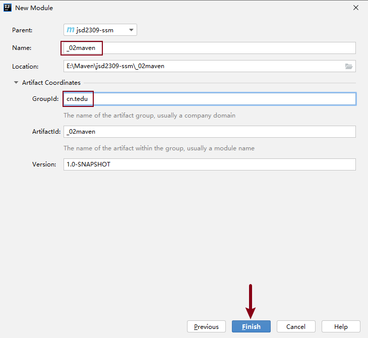

* 第4步：源代码目录下创建文件：`cn.tedu.Hello`

  ```java
  package cn.tedu;
  
  public class Hello {
      public static void main(String[] args) {
          System.out.println("Hello Maven");
      }
  }
  ```

* 执行 `Maven` 命令

  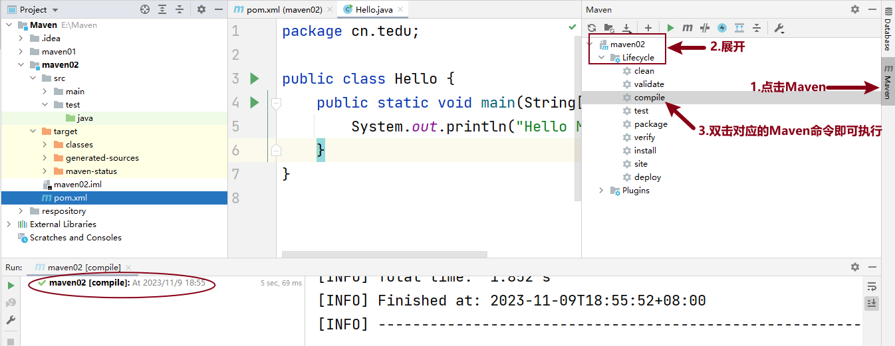

#### 8.3 添加依赖

<font color=red>**在 pom.xml 中添加 MySQL 的依赖**</font>

* `pom.xml`

  ```xml
  <dependencies>
      <dependency>
          <groupId>mysql</groupId>
          <artifactId>mysql-connector-java</artifactId>
          <version>8.0.31</version>
      </dependency>
  </dependencies>
  ```

* <font color=red>**刷新Maven**</font>

  

