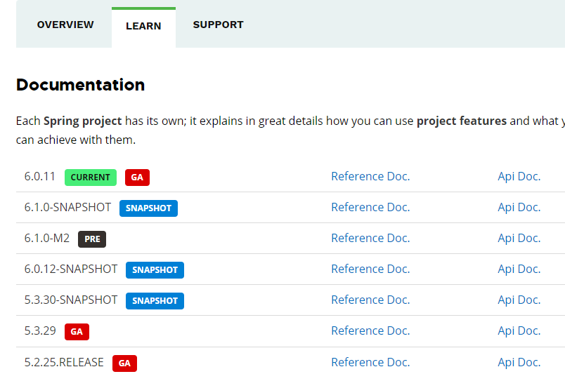
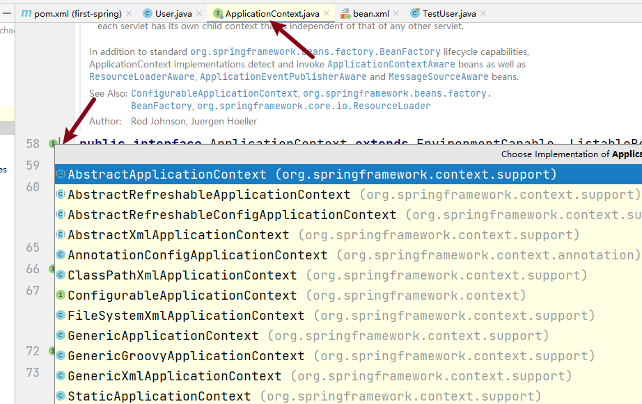
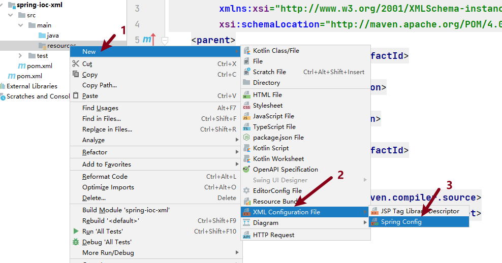
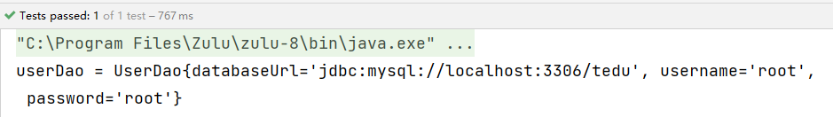
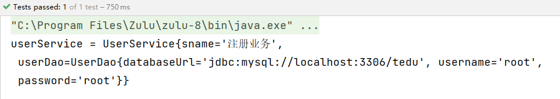
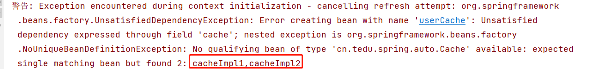
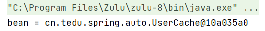
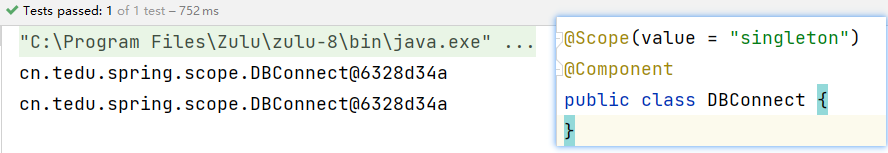
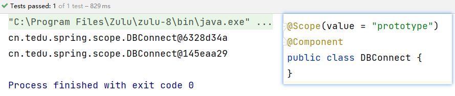
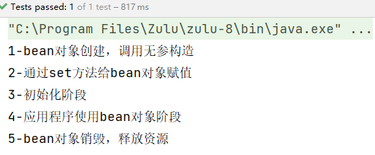

[TOC]


## 1 spring概述

### 1.1 Spring定义

​	Spring是一款主流的 Java EE 开源框架，目的是用于简化Java企业级引用的开发难度和开发周期。从简单性、可测试性的角度而言，任何Java应用都可以从Spring中受益。Spring框架提供自己提供功能外，还提供整合其他技术和框架的能力。

​	自2004年4月，Spring1.0 版正式发布以来，Spring已经步入到了第6个大版本，即 Spring6，本课程采用 **Spring5.3.24** 正式版本。

Spring官网地址：https://spring.io/




### 1.2 Spring核心

<font color=red>**Spring指的是Spring Framework，通常我们称之为Spring框架。**</font>

Spring的两个核心模块

* **IoC控制反转**

  `Inverse of Control` 的简写，为 控制反转，指把创建对象交给 `Spring` 进行管理。

  即：反转资源获取方向，把自己创建资源、向环境索取资源的方式变为环境自动将资源准备好，我们享受资源注入。

* **AOP面向切面编程**

  `Aspect Oriented Programming` 的简写，为 面向切面编程。`AOP` 用来封装多个类的公共行为，将那些与业务无关，却为业务模块共同调用的逻辑封装起来，减少系统的重复代码。


## 2 入门案例

工程环境

* JDK版本：Java 8-15

* Spring版本：5.3.24

#### 2.1 入门案例

* 第1步：聚合工程下构建子工程 `_03spring`；

* 第2步：pom.xml中添加依赖并刷新 `Maven`；

  ```xml
  <dependencies>
      <!-- Maven坐标：https://mvnrepository.com/artifact/org.springframework/spring-context -->
      <!-- 引入spring context依赖-->
      <dependency>
          <groupId>org.springframework</groupId>
          <artifactId>spring-context</artifactId>
          <version>5.3.24</version>
      </dependency>
  </dependencies>
  ```

* 第3步：工程中创建包 `cn.tedu.spring.example`，并创建类 `User.java`，添加 `@Component` 注解；

  ```java
  package cn.tedu.spring.example;
  import org.springframework.stereotype.Component;
  
  /**
   * @Component 注解描述的类，表示此类交给Spring框架管理。
   */
  @Component
  public class User {
      public void userRun(){
          System.out.println("User is do something~~");
      }
  }
  ```

* 第4步：创建测试类 `TestUser.java` 进行测试；

  ```java
  package cn.tedu.spring.example;
  import org.springframework.context.ApplicationContext;
  import org.springframework.context.annotation.AnnotationConfigApplicationContext;
  
  public class TestUser {
      public static void main(String[] args) {
          /* 方式1：new方式创建java对象 */
          User user2 = new User();
          System.out.println("user2 = " + user2);
          user2.userRun();
  
          /** 方式2：反射方式创建java对象
           1.获取class对象
           2.调用方法进行创建
           */
          Class zz = Class.forName("cn.tedu.spring.example.User");
          User user3 = (User) zz.newInstance();
          System.out.println("user3 = " + user3);
          user3.userRun();
          
          // AnnotationConfigApplicationContext扫描这个包中所有带有@Component注解的类,并根据这些类创建相应的Spring组件
          /*
           方式3：通过spring创建 java bean 对象
           */
          ApplicationContext context = new AnnotationConfigApplicationContext("cn.tedu.spring.example");
          User user1 = context.getBean(User.class);
          System.out.println("user1 = " + user1);
          user1.userRun();
      }
  }
  ```

## 3 相关概念

### 3.1 IoC

IoC（`Inversion of Control`，控制反转）是一种编程思想；

<font color=red>**`IoC` 是将对象的创建和管理交由框架来完成，而不是由开发人员手动创建和管理。**</font>

### 3.2 IoC容器

IoC容器是用来实现IoC思想的一个工具或者说技术手段；

它能够自动扫描应用程序中的对象，将它们实例化，并自动注入它们所需要的依赖对象，使应用程序的开发人员能够更加专注于业务逻辑的实现，而不用关心对象的创建和管理。Spring通过IoC容器来管理所有的Java对象的实例化和初始化，控制着对象与对象之间的依赖关系。

<font color=red>**我们将由IoC容器管理的Java对象成为 Spring Bean，它与使用关键字 new 创建的Java对象没有任何区别。**</font>

### 3.3 依赖注入DI

DI （Dependency Injection）：依赖注入，依赖注入实现了控制反转的思想，是指Spring创建对象的过程中，将对象依赖属性通过配置进行注入。

所以 IoC 是一种控制反转的思想，而依赖注入 DI 是对 IoC 的一种具体实现。

Bean管理：指Bean对象的创建，以及Bean对象中属性的赋值

## 4 IoC容器实现

Spring中的IoC容器就是IoC思想的一个落地产品实现。IoC容器中管理的组件也叫做bean。在创建bean之前，首先需要创建IoC容器，Spring提供了IoC容器的两种实现方式

* **BeanFactory**

  这是IoC容器的基本实现，是Spring内部使用的接口，面向Spring本身，不提供给开发人员使用。

* **ApplicationContext**

  BeanFactory的子接口，提供了更多高级特性，面向Spring的使用者，几乎所有场合都使用 ApplicationContext，而不使用底层的BeanFactory。

<font color=red>**源码说明：**</font>




* ApplicationContext的主要实现类

  |                类型                |                 说明                  |
  | :--------------------------------: | :-----------------------------------: |
  | AnnotationConfigApplicationContext |        使用注解方式构建IoC容器        |
  |   ClassPathXmlApplicationContext   | 使用XML配置文件方式构建Spring IoC容器 |


## 5 xml管理Bean

### 5.1 XML配置Bean

​	在Spring框架中，Bean的配置可以通过 `XML` 文件来完成。这个文件通常被称为 `Spring` 配置文件或 `Spring XML` 文件。

* **第1步：工程目录下创建Java类：cn.tedu.spring.example.UserXml.java**

  ```java
  package cn.tedu.spring.example;
  
  public class UserXml {
      private String username;
      private String password;
  
      public void run(){
          System.out.println("run方法执行");
      }
  }
  ```

* **第2步：创建spring配置文件 resources/bean.xml**

  

* **第3步：bean.xml 文件配置Bean**

  ```xml
  <!--
       id属性值：唯一标识；
       class属性值：Java类的绝对路径
  -->
  <bean id="userXml" class="cn.tedu.spring.example.UserXml"></bean>
  ```

* **第4步：TestUserXml.java 中获取Bean对象**

  * 方式1：根据 `id` 获取

    ```java
    ApplicationContext context = new ClassPathXmlApplicationContext("bean.xml");
    UserXml userXml1 = (UserXml) context.getBean("userXml");
    userXml1.run();
    ```

  * 方式2：根据 `class` 类型获取

    ```java
    ApplicationContext context = new ClassPathXmlApplicationContext("bean.xml");
    UserXml userXml2 = context.getBean(UserXml.class);
    userXml2.run();
    ```

  * 方式3：根据 `id` 和 `class` 获取

    ```java
    ApplicationContext context = new ClassPathXmlApplicationContext("bean.xml");
    UserXml userXml3 = context.getBean("userXml", UserXml.class);
    userXml3.run();
    ```

### 5.2 依赖注入DI

DI （Dependency Injection）：依赖注入，依赖注入实现了控制反转的思想；

<font color=red>**是指Spring创建对象的过程中，将对象依赖属性通过配置进行注入。**</font>

所以 IoC 是一种控制反转的思想，而依赖注入 DI 是对 IoC 的一种具体实现。

#### 5.2.1 xml语法

```xml
<bean id="book" class="cn.tedu.spring.DI.Book">
    <!--使用property标签注入-->
    <property name="bookName" value="java"></property>
    <property name="bookAuthor" value="tedu"></property>
</bean>
```

#### 5.2.2 案例演示

* **第1步：工程目录创建Java类 cn.tedu.spring.dibase.Book**

  ```java
  package cn.tedu.spring.dibase;
  
  public class Book {
      private String bookName;
      private String bookAuthor;
  
      public void setBookName(String bookName) {
          this.bookName = bookName;
      }
  
      public void setBookAuthor(String bookAuthor) {
          this.bookAuthor = bookAuthor;
      }
  
      @Override
      public String toString() {
          return "Book{" +
                  "bookName='" + bookName + '\'' +
                  ", bookAuthor='" + bookAuthor + '\'' +
                  '}';
      }
  }
  ```

* **第2步：创建Spring配置文件 bean-di.xml**

  ```xml
  <bean id="book" class="cn.tedu.spring.dibase.Book">
      <!--使用property标签注入-->
      <property name="bookName" value="java"/>
      <property name="bookAuthor" value="tedu"/>
  </bean>
  ```

* **第3步：创建测试类 TestBook.java 进行测试**

  ```java
  public class TestBook {
      public static void main(String[] args) {
          ApplicationContext context = new ClassPathXmlApplicationContext("bean-di.xml");
          Book book = context.getBean(Book.class);
          System.out.println("book = " + book);
      }
  }
  ```

### 5.3 课堂练习

1. cn.tedu.spring下创建包 `eg1`，在包下创建学生类 `Student`，类属性如下：

   <font color=red>注意 set() 和 toString() 方法</font>

   学生姓名：name

   学生年龄：age

   学生性别：gender

2. 通过配置文件 `bean-student.xml` , 创建 `Bean` 对象并注入一组属性值；

3. 创建测试类 `TestStudent` 进行测试。

## 6 注解管理Bean

### 6.1 Bean对象定义及获取

在Spring框架规范中，所有由spring管理的对象都称之为Bean对象。

#### 6.1.1 Bean对象定义

Spring提供了以下多个注解，这些注解可以直接标注在java类上，将它们定义成Spring Bean。

|    注解     |                             说明                             |
| :---------: | :----------------------------------------------------------: |
| @Component  | 该注解用于描述Spring中的Bean，它是一个泛化的概念，仅仅标识容器中的一个组件（Bean），并且可以作用在任何层次，例如Service层、Dao层等，使用时只需将该注解标注在相应的类上即可。 |
| @Repository | 该注解用于数据访问层（Dao层）的类标识为Spring中的Bean，功能与@Component相同。 |
|  @Service   | 该注解通常作用在业务层（Service层），用于将业务层的类标识为Spring中的Bean，其功能与@Component相同。 |
| @Controller | 该注解通常作用在控制层（如SpringMVC的Controller），用于将控制层的类标识为Spring中的Bean，其功能与@Component相同。 |

#### 6.1.2 Bean对象获取

​	通过 `ApplicationContext` 对象获取：调用 `ApplicationContext` 对象的 `getBean()` 方法，传入对应类的类型即可获取该 `Bean` 对象，示例：

```java
ApplicationContext context = new AnnotationConfigApplicationContext("包扫描路径");
User user = context.getBean(类名.class);
```

#### 6.1.3 应用分析

<font color=red>**在 cn.tedu.spring 下创建子包 bean ，进行 bean 对象的创建及获取**</font>

* 第1步：在bean包下创建类：**UserDao**

  ```java
  @Repository
  public class UserDao {
      private String databaseUrl;
      private String username;
      private String password;
  }
  ```

* 第2步：在bean包下创建测试类：**TestUserDao**

  ```java
  public class TestUserDao {
      @Test
      public void testBean(){
          ApplicationContext context = new AnnotationConfigApplicationContext("cn.tedu.spring.bean");
          UserDao userDao = context.getBean(UserDao.class);
          System.out.println("userDao = " + userDao);
      }
  }
  ```

  <font color=red>**说明：将java类中的 @Repository注解 替换为 @Component注解、@Service注解、@Controller注解 都是可以的。**</font>

### 6.2 依赖注入DI

#### 6.2.1 @Value注解

`@Value` 注入是将属性值直接注入到 `bean` 中，主要用于注入一些简单类型的属性（<font color=red>**如字符串、基本类型等**</font>）；

使用时需要注意属性的类型和格式，否则会导致注入失败。

<font color=red>**示例：在UserDao中进行属性值注入**</font>

* 第1步：在UserDao的属性中通过@Value注解注入属性值

  ```java
  @Repository
  public class UserDao {
      @Value("jdbc:mysql://localhost:3306/tedu")
      private String databaseUrl;
      @Value("root")
      private String username;
      @Value("root")
      private String password;
  
      @Override
      public String toString() {
          return "UserDao{" +
                  "databaseUrl='" + databaseUrl + '\'' +
                  ", username='" + username + '\'' +
                  ", password='" + password + '\'' +
                  '}';
      }
  }
  ```

* 第2步：执行测试方法进行测试

  

* **练习**

  1. 在工程目录 `cn.tedu.spring` 下创建包 `eg2`；

  2. 在 `eg2` 中创建商品类 `Product` ，属性包含：商品标题`title`、商品库存`num`、商品描述`comment`，

     将该类交由`spring`框架管理，并注入属性值（DI注入）,`title`和`num`在属性上, `comment`在`set`方法上注入；

  3. 创建测试类 `TestProduct` ，进行 `Spring Bean` 对象的创建、依赖注入 及 `bean`对象的获取。


#### 6.2.2 @Autowired注解

`@Autowired` 注入是将对象注入到 `bean` 中，并且在注入对象时会根据依赖注入容器中 **bean的类型** 进行匹配。

如果容器中有多个类型匹配的`bean`存在，则会抛出异常。

因此，@Autowired注入常用于注入复杂对象、接口类型的属性或其他`bean`实例。

##### 6.2.2.1 根据类型注入

<font color=red>**定义UserService类，并注入UserDao对象**</font>

* 第1步：在包bean下创建 `UserService` 类

  ```java
  @Service
  public class UserService {
      @Value("注册业务")
      private String sname;
      // Autowired自动装配
      @Autowired
      private UserDao userDao;
  
      @Override
      public String toString() {
          return "UserService{" +
                  "sname='" + sname + '\'' +
                  ", userDao=" + userDao +
                  '}';
      }
  }
  ```

* 第2步：调整测试方法

  ```java
  public class TestUserDao {
      public static void main(String[] args) {
          ApplicationContext context = new AnnotationConfigApplicationContext("cn.tedu.spring.bean");
          UserDao userDao = context.getBean(UserDao.class);
          System.out.println("userDao = " + userDao);
  
          UserService userService = context.getBean(UserService.class);
          System.out.println("userService = " + userService);
      }
  }
  ```

* 第3步：执行测试方法测试

  

##### 6.2.2.2 根据接口类型注入

​	进行依赖注入时，如果指定的是接口 `Interface`，`Spring` 框架会自动找到该接口对应的实现类并创建 `bean` 对象注入吗？

<font color=red>**在 cn.tedu.spring 下创建子包 auto**</font>

* 第1步：创建接口 `Cache`

  ```java
  package cn.tedu.spring.auto;
  
  public interface Cache {
  }
  ```

* 第2步：创建该接口实现类 `CacheImpl1` ，并添加 `@Component注解`

  ```java
  package cn.tedu.spring.auto;
  
  import org.springframework.stereotype.Component;
  
  @Component
  public class CacheImpl1 implements Cache{
  }
  ```

* 第3步：创建类 `UserCache` ，并注入 `CacheImpl1对象`

  ```java
  @Component
  public class UserCache {
      @Autowired
      private Cache cache;
  }
  ```

* 第4步：创建测试类 `TestUserCache` 进行测试

  ```java
  public class TestUserCache {
      public static void main(String[] args) {
          ApplicationContext context = new AnnotationConfigApplicationContext("cn.tedu.spring.auto");
          Cache bean = context.getBean(UserCache.class);
          System.out.println("bean = " + bean);
      }
  }
  ```

  <font color=red>**总结： 当一个接口有一个唯一的实现类时，Spring框架会通过接口找到该接口对应的实现类，并进行bean对象的创建以及DI注入操作。**</font>


<font color=blue>**问题：那么如果一个接口有多个实现类，Spring框架会创建对应的 java bean 对象吗？**</font>

* 第1步：创建 Cache 接口的实现类 `CacheImpl2`

  ```java
  @Component
  public class CacheImpl2 implements Cache{
  }
  ```

* 第2步：执行测试方法，确认是否成功

  

  

  <font color=red>**总结： 当一个接口有多个实现类时，Spring无法确定注入哪个实现类对象，因此会报错，可以结合 `@Qualifier注解` 来解决这个问题。**</font>

##### 6.2.2.3 练习

* 工程目录下 `cn.tedu.spring` 创建包 `eg3`；

* 创建接口：`Mapper`;

* 创建接口实现类：`MapperImpl1` ，并将此类交由 `Spring` 框架管理；

* 创建控制器类：`CommentMapper`，通过接口方式注入 `Mapper` 对象；

* 创建测试类  `TestMapper` ，进行 `Spring Bean` 对象的创建及依赖注入测试；

* 创建实现类 `MapperImpl2`，并将此类交由 `Spring` 框架管理，进行测试。

* 通过 `@Qualifier` 注解实现依赖注入.


#### 6.2.3 @Qualifier注解

@Qualifier注解是用于限定一个接口有多个实现类时，根据指定的限定条件来选择具体的实现类的注解；

当Spring容器中存在多个实现同一接口的bean时，在注入时，由于不能确定注入哪一个实现类，就需要通过@Qualifier注解来明确指定要注入的bean的名称。

<font color=red>**@Qualifier注解演示**</font>

* 第1步：在 `UserCache` 中添加 `@Autowired注解` 和 `@Qualifier注解`

  ```java
  @Component
  public class UserCache {
      @Autowired
      @Qualifier("aaa")
      private Cache cache;
  }
  ```

* 第2步：在 `CacheImpl1` 实现类中 `@Component注解` 中添加组件名

  ```java
  @Component("aaa")
  public class CacheImpl1 implements Cache{
  }
  ```

* 第3步：执行测试方法进行测试

  

  <font color=red>**总结：在@Component注解中可以不用指定组件名称，默认为当前类的 类名首字母小写。**</font>

#### 6.2.4 @Resource注解[了解]

`@Resource` 注解是 `JavaEE` 提供的注解之一，也支持在 `Spring Framework` 中使用。在 `Spring` 中，它可以用来注入 `Bean` 实例，与`@Autowired`注解的作用类似，但其也有自己的一些特点。

* `@Resource` 注解是JDK扩展包中的，也就是说属于JDK的一部分。所以该解释是标准注解，而 `@Autowired` 注解是 `Spring` 框架自己的。

* 装配规则

  * `@Resource` 注解默认根据名称装配 `byName`；
  * 当未指定 `name` 时，则使用属性名作为 `name` 进行装配；
  * 如果通过 `name` 也未找到，则会自动启动通过类型 `byType` 装配。

  **而@Autowired注解默认根据类型装配byType，如果想根据名称匹配，需要配合@Qualifier注解一起使用。**

* <font color=red>**课堂示例**</font>

  * 包名：`resource`


  * 接口：`ResMapper`


  * 实现类1：`ResMapperImpl1`


  * 实现类2：`ResMapperImpl2`


  * DI注入类：`WeiboMapper`


  * 测试类：`TestWeiboMapper`


* <font color=red>**总结**</font>

  * 指定 `@Resource` 中的 `name`，则根据名称装配；

  * 未指定 `name` 时，则根据属性名装配；

  * 未指定 `name`，属性名也不一致，则根据类型装配.

### 6.3 Bean作用域

#### 6.3.1 说明

​	在Spring框架中，Bean是按照作用域来创建的，常见的作用域有两种：`Singleton` 和 `Prototype`。其中，`Singleton` (单例)是指整个应用中只有一个实例，并在第一次请求时创建实例。而 `Prototype` (多例)是指每次请求都会创建一个新的实例并返回，每个实例之间是相互独立的。可以通过 `@Scope` 注解来指定，默认是单实例。

#### 6.3.2 单实例与多实例

* 单实例

  单实例（Singleton）是指某个类只能创建唯一的一个实例对象，并且该类提供一个全局的访问点（静态方法）来让外界获取这个实例，常常用在那些只需要一个实例来处理所有任务的场景下，例如数据库连接。

* 多实例

  多实例（Multiple Instance）则是指可以在同一个类的定义下，创建多个实例对象。每个对象都是相互独立的，有自己的状态和行为；常常用于需要同时处理多个任务的场景。

<font color=red>**在Spring中可以通过 `@Scope` 注解来指定bean的作用域范围，具体如下**</font>

|              取值               |                含义                 |
| :-----------------------------: | :---------------------------------: |
| @Scope("singleton")（**默认**） | 在IoC容器中，这个bean的对象为单实例 |
|       @Scope("prototype")       |    这个bean在IoC容器中有多个实例    |

#### 6.3.3 应用分析

* 第1步：在 **cn.tedu.spring** 下创建子包 **scope** ，并创建类 `DBConnect`

  ```java
  @Scope(value = "singleton")
  @Component
  public class DBConnect {
  }
  ```

* 第2步：创建测试类进行测试

  ```java
  public class TestDBConnect {
      @Test
      public void testScope(){
          ApplicationContext context = new AnnotationConfigApplicationContext("cn.tedu.spring.scope");
          // 第一次获取
          DBConnect dbConnect1 = context.getBean(DBConnect.class);
          System.out.println(dbConnect1);
          // 第二次获取
          DBConnect dbConnect2 = context.getBean(DBConnect.class);
          System.out.println(dbConnect2);
      }
  }
  ```

* **总结**

  * <font color=red>**当为单例模式 singleton 时，多次获取bean实例的地址是相同的**</font>

    

  * <font color=red>**当为多例模式 prototype 时，多次获取bean实例的地址是不同的**</font>

    


**<font color=red>单例模式适用于需要共享数据并且需要避免重复创建实例的情况。而多例模式适用于需要动态地创建对象并提供独立实例的情况。</font>**

### 6.4 Bean生命周期

#### 6.4.1 说明

程序中的每个对象都有生命周期，对象的创建、初始化、应用、销毁的整个过程称之为对象的生命周期；

在对象创建以后需要初始化，应用完成以后需要销毁时执行的一些方法，可以称之为是生命周期方法；

在spring中，可以通过 `@PostConstruct` 和 `@PreDestroy` 注解实现 bean对象 生命周期的初始化和销毁时的方法。

* `@PostConstruct` 注解

  生命周期初始化方法，在对象构建以后执行。

* `@PreDestroy` 注解

  生命周期销毁方法，比如此对象存储到了spring容器，那这个对象在spring容器移除之前会先执行这个生命周期的销毁方法（注：prototype作用域对象不执行此方法）。

#### 6.4.2 完整生命周期

1. 实例化阶段（bean对象创建）

   在这个阶段中，IoC容器会创建一个Bean的实例，并为其分配空间。这个过程可以通过 **构造方法** 完成。

2. 属性赋值阶段

   在实例化完Bean之后，容器会把Bean中的属性值注入到Bean中，这个过程可以通过 **set方法** 完成。

3. 初始化阶段（bean对象初始化）

   在属性注入完成后，容器会对Bean进行一些初始化操作；

4. 使用阶段

   初始化完成后，Bean就可以被容器使用了

5. 销毁阶段

   容器在关闭时会对所有的Bean进行销毁操作，释放资源。

#### 6.4.3 生命周期验证

* 第1步：`DBConnect` 类中打印生命周期过程

  ```java
  @Scope(value = "singleton")
  @Component
  public class DBConnect {
      private String username;
  
      /**
       * 1.调用无参构造方法进行bean对象创建
       */
      public DBConnect() {
          System.out.println("1-bean对象创建，调用无参构造");
      }
  
      /**
       * 2.通过setter()方法进行属性赋值
       */
      @Value("root")
      public void setUsername(String username) {
          this.username = username;
          System.out.println("2-通过set方法给bean对象赋值");
      }
  
      /**
       * 3.对象创建后可以通过此方法进行初始化
       */
      @PostConstruct
      public void init(){
          System.out.println("3-初始化阶段");
      }
  
      /**
       * 5.对象销毁前可以通过此方法进行资源释放
       */
      @PreDestroy
      public void destroy(){
          System.out.println("5-bean对象销毁，释放资源");
      }
  }
  ```

* 第2步：测试类中打印生命周期过程

  ```java
  public class TestDBConnect {
      @Test
      public void testScope(){
          AnnotationConfigApplicationContext context = new AnnotationConfigApplicationContext("cn.tedu.spring.scope");
          DBConnect dbConnect = context.getBean(DBConnect.class);
          // 4.bean对象初始化完成，可以使用
          System.out.println("4-应用程序使用bean对象阶段");
          // 销毁bean
          context.close();
      }
  }
  ```

* 第3步：生命周期结果验证

  

<font color=red>**练习**</font>

创建包 `eg4`, 并创建类 `ShopController` ，请自行完成 `Spring Bean` 生命周期的每步验证。

#### 6.4.4 生命周期扩展

Bean初始化和销毁方法可以在Bean生命周期的特定时机执行自定义逻辑，方便地对Bean进行管理和配置。

* 初始化常见应用场景
  - 创建数据库连接
  - 加载资源文件
  - 进行数据校验
* 销毁常见应用场景
  - 断开数据库连接
  - 保存数据
  - 释放占用的资源

### 6.5 引用外部属性文件

#### 6.5.1 说明

实际开发中，很多情况下我们需要对一些变量或属性进行动态配置，而这些配置可能不应该硬编码到我们的代码中，因为这样会降低代码的可读性和可维护性。

我们可以将这些配置放到外部属性文件中，比如`database.properties`文件，然后在代码中引用这些属性值，例如`jdbc.url`和`jdbc.username`等。这样，我们在需要修改这些属性值时，只需要修改属性文件，而不需要修改代码，这样修改起来更加方便和安全。

而且，通过将应用程序特定的属性值放在属性文件中，我们还可以将应用程序的配置和代码逻辑进行分离，这可以使得我们的代码更加通用、灵活。

#### 6.5.2 使用流程

* 第1步：创建外部属性文件（在 `resources` 目录下创建文件，命名为："xxx.properties"）；

* 第2步：引入外部属性文件（使用 `@PropertySource("classpath:外部属性文件名")` 注解）；

* 第3步：获取外部属性文件中的变量值 （使用 `${变量名}` 方式）；

* 第4步：进行属性值注入.

#### 6.5.3 应用分析

* 第1步：在 `resources` 目录下创建文件 ：`database.properties`

  ```properties
  spring.datasource.username=root
  spring.datasource.password=root
  spring.datasource.url=jdbc://mysql://localhost:3306/test
  ```

* 第2步：工程目录下创建子包 `file` 并创建类 `Database`

  * 通过 `@PropertySource` 注解引入外部文件

  * 通过 `${变量名}` 获取属性值

  * 通过 `@Value()` 注解进行属性值注入

  ```java
  @Component
  @PropertySource("classpath:database.properties")
  public class Database {
      @Value("${jdbc.url}")
      private String url;
      @Value("${jdbc.user}")
      private String username;
      @Value("${jdbc.password}")
      private String password;
  
      @Override
      public String toString() {
          return "Database{" +
                  "url='" + url + '\'' +
                  ", username='" + username + '\'' +
                  ", password='" + password + '\'' +
                  '}';
      }
  }
  ```

* 第3步：创建测试类 `TestDatabase` 进行测试

  ```java
  public class TestDatabase {
      @Test
      public void testFile(){
          ApplicationContext context = new AnnotationConfigApplicationContext("cn.tedu.spring.file");
          Database database = context.getBean(Database.class);
          System.out.println(database);
      }
  }
  ```

### 6.6 自动扫描配置

#### 6.6.1 说明

自动扫描配置是 Spring 框架提供的一种基于注解（Annotation）的配置方式，用于自动发现和注册 Spring 容器中的组件。当我们使用自动扫描配置的时候，只需要在需要被 Spring 管理的组件（比如 Service、Controller、Repository 等）上添加对应的注解，Spring 就会自动地将这些组件注册到容器中，从而可以在其它组件中使用它们。

在 Spring 中，通过 `@ComponentScan` 注解来实现自动扫描配置。

`@ComponentScan` 注解用于指定要扫描的包或类。

Spring 会在指定的包及其子包下扫描所有添加 `@Component`（或 `@Service`、`@Controller`、`@Repository` 等）注解的类，把这些类注册为 Spring Bean，并纳入 Spring 容器进行管理。

#### 6.6.2 使用示例

```java
@Configuration
@ComponentScan("cn.tedu.srping")
public class AppConfig {

}
```

在此示例中，

* `@Configuration` 注解

  表示将类 `AppConfig` 标识为一个 Spring 配置类，Spring 会来加载此类，并且读取其中的配置。

* `@ComponentScan` 注解

  用于指定扫描的包路径 `com.example.app`。

  Spring 会自动在 `cn.tedu.spring` 包及其子包下扫描所有被 `@Component` 等注解标注的类，并将这些类注册为 Spring Bean。

#### 6.6.3 应用分析

* 第1步： 工程下创建包 **config**，并在此包下创建类 **SpringConfig**

  ```java
  /**
   * @Configuration注解： 将类 SpringConfig 标识为一个 Spring 配置类
   */
  /**
   * @ComponentScan注解：指定要扫描的包路径 cn.tedu.spring，包含该包下的子包
   */
  @Configuration
  @ComponentScan("cn.tedu.spring")
  public class SpringConfig {
  
  }
  ```

* 第2步：创建测试类 **TestScan** 进行测试

  ```java
  public class TestScan {
      @Test
      public void testScan(){
          // 指定配置类:SpringConfig
          ApplicationContext context = new AnnotationConfigApplicationContext(SpringConfig.class);
          // 获取bean对象
          Database database = context.getBean(Database.class);
          System.out.println(database);
  		// 获取bean对象
          UserCache userCache = context.getBean(UserCache.class);
          System.out.println("userCache = " + userCache);
      }
  }
  ```


