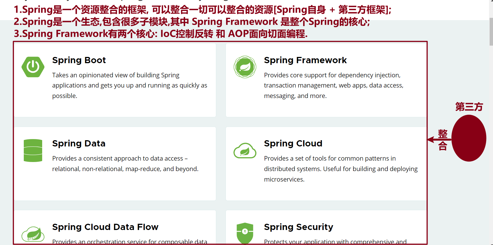

[toc]

### 1 框架

<font color=red>**让程序员专注于业务逻辑, 进而提升开发效率.**</font>

框架的主要作用是帮助开发人员快速、高效地开发应用程序，提供一套完整的系统结构、规范的开发流程、通用的功能和模块、配置文件管理、错误和异常管理以及数据库支持等，为开发人员提供了便利的开发工具和方法。

- Java相关框架：`Spring`
- Python相关框架：`Django、Flask、Tornado`

### 2 Spring框架

官网: [https://spring.io](https://gitee.com/link?target=https%3A%2F%2Fspring.io)

#### 2.1 定义



#### 2.2 Spring版本

- Spring6: 只支持 `JDK17` 及以上版本
- Spring5: 支持 `JDK8-15` 版本,课程中采用: **5.3.24**

#### 2.3 使用流程-注解方式

- 第1步: 添加依赖, 刷新 `maven`;

  ```xml
  <dependency>
  	<groupId>org.springframework</groupId>
      <artifactId>spring-context</artifactId>
      <version>5.3.24</version>
  </dependency>
  ```

- 第2步: 在指定类上添加相关注解: `@Component,@Controller,@Service,@Repository`

- 第3步: 创建测试类

  ```java
  //1.创建IoC容器;
  ApplicationContext context = new AnnotationConfigApplicationContext("包扫描路径");
  //2.获取Bean;
  context.getBean(类型.class);
  ```

### 3 对象

- `Java` 对象: 开发人员手动创建的对象, 叫做 `Java` 对象.

- `Spring Bean` 对象: 由 `Spring` 框架创建的对象叫做 `Spring Bean` 对象.

  <font color=red>**这两种对象在使用上没有任何差别, 只是为了区分对象创建的方式.**</font>

### 4 相关概念

- IoC

  控制反转的编程思想, 反转资源的获取方向;

  把对象的创建和管理交由框架来完成, 而不是由开发人员手动创建和管理.

- IoC容器

  实现IoC控制反转思想的一种技术手段.

  <font color=red>**创建IoC容器: 通过 `ApplicationContext` 接口实现**</font>

  ```java
  ApplicationContext context = new AnnotationConfigApplicationContext("包路径");
  ApplicationContext context = new ClasspathXmlConfigApplicationContext("xxx.xml");
  ```

- 依赖注入-DI

  给 `Spring Bean` 对象的属性赋值.

  <font color=red>**IoC是控制反转思想, IoC容器和DI依赖注入是实现IoC控制反转思想的两种技术手段.**</font>

### 5 常用注解

#### 5.1 标识为Spring Bean注解

- Component
  - 添加在类上，创建Spring Bean对象；
  - 不分层。
- Controller
  - 添加在类上，创建Spring Bean对象；
  - 控制器层：负责接收请求并返回响应。
- Service
  - 添加在类上，创建Spring Bean对象；
  - 业务层：负责具体业务逻辑处理。
- Repository
  - 添加在类上，创建Spring Bean对象；
  - 数据访问层：负责和数据库[**MySQL和MariaDB**]交互。

#### 5.2 DI依赖注入注解

- `@Value`

  <font color=red>**2个位置**</font>：添加在属性上, set方法上

  简单类型依赖注入.

- `@Autowired`

  <font color=red>**3个位置**</font>：添加在属性上，添加在set方法上，构造方法上；

  对象类型或者接口类型依赖注入，默认根据 **类型** 进行装配；

- `@Qualifier`

  根据 `Spring Bean`对象的名称进行注入, 经常配合 `@Autowired` 注解一起使用;

  当一个接口有多个实现类时, 可以通过 `@Qualifier(value="Bean对象名称")` 指定需要注入的对象.


### 6 今日单词

* Spring Framework
* ApplicationContext
* AnnotationConfigApplicationContext
* ClasspathXmlApplicationContext
* Component
* Controller
* Serivce
* Repository
* bean
* property


###  常见异常

- `NoSuchBeanDefinitionException`

  ```java
  org.springframework.beans.factory.NoSuchBeanDefinitionException: No qualifying bean of type 'cn.tedu.spring.bean.UserService' available ...
  ```

  **解决方案：**

  - 查看该类上是否添加标识为 `Spring` 组件的注解；
  - 检查相关注解 `Spring Bean` 对象的名称是否一致；

- `NoUniqueBeanDefinitionException`

  ```java
  Caused by: org.springframework.beans.factory.NoUniqueBeanDefinitionException: No qualifying bean of type 'cn.tedu.spring.auto.Cache' available: expected single matching bean but found 2: AAAA,cacheImpl2
  ```

  **解决方案：**

  一个接口有多个实现类，通过 `@Qualifier` 或者 `@Resource` 注解指定唯一的 `Bean` 对象的名称.


