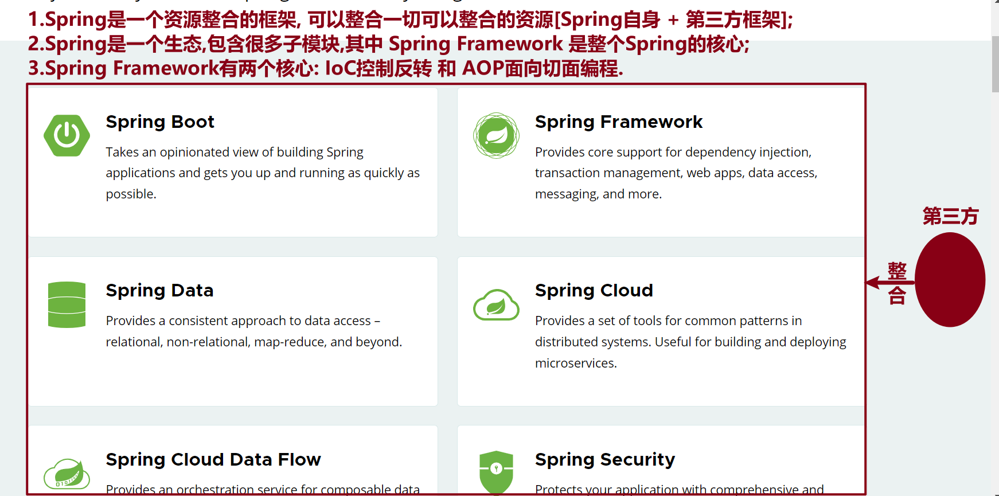

SSM框架

* Spring Framework
* Spring MVC
* MyBatis

### 框架

快速搭建工程环境,让开发人员更加专注于 业务逻辑.

不同的编程语言有不同的框架,比如:

* JAVA: **Spring框架**
* Python: **Django框架   Flask框架   Tornado框架**

### 步骤

* 第1步：添加 `Spring Framework` 依赖，刷新 `Maven`；
* 第2步：创建 `Java` 类；
* 第3步：通知框架帮我们创建对象；
* 第4步：获取对象并直接使用.

